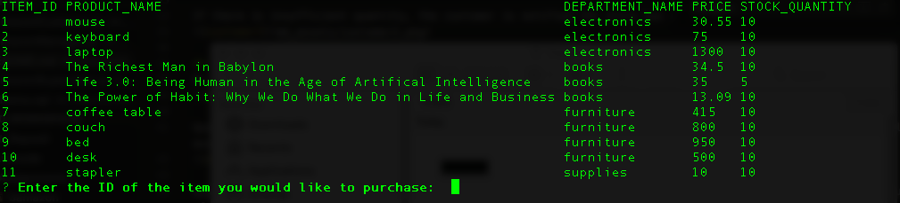
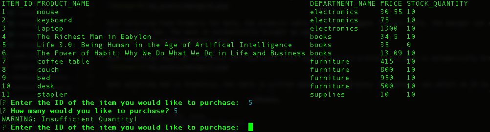

# bamazon
Copy and paste this schema into a working into an sql query to play with the app!

```sql
DROP DATABASE IF EXISTS bamazon;
CREATE DATABASE bamazon;

USE bamazon;

CREATE TABLE products(
    item_id INT NOT NULL AUTO_INCREMENT,
    product_name VARCHAR(100) NOT NULL,
    department_name VARCHAR(100) NOT NULL,
    price DECIMAL(11,2) NULL,
    stock_quantity INT(11) NOT NULL,
    product_sales DECIMAL(11,2) NOT NULL,
    PRIMARY KEY(item_id)
);

CREATE TABLE departments(
    department_id INT NOT NULL AUTO_INCREMENT,
    department_name VARCHAR(100) NOT NULL,
    over_head_costs DECIMAL(11,2) NULL,
    PRIMARY KEY(department_id)
);
```
## bamazonCustomer.js
On start, the console will print out all the columns (except product_sales) of the products table.


The customer may then enter what and how many he wants to buy.


If there is insufficient quantity, the customer is notified the store has an insufficient quantity and is prompted again.


## bamazonManager.js
On start, the console will print a menu for the manager. 


Upon selecting View Products for Sale, the products table is console logged. In this table, the manager can also see how much sales each product has. The menu is automatically brought up again.


Upon selecting View Low Inventory, all rows with stock less than 5 are printed. The menu is automatically brought up again.


Upon selecting Add to Inventory, the table is printed again for convenience. The manager can select an ID to add items to and add items. The menu is brought up again automatically. Here we select View Products for Sale again to see that the table has successfully updated. 


Upon selecting Add New Product, the manager is prompted several times for product info. After it is input, it is added into the databse. The menu is brought up again automatically. Here we select View Products for Sale again to see that the table has successfully updated. 


On exit, the program ends.


